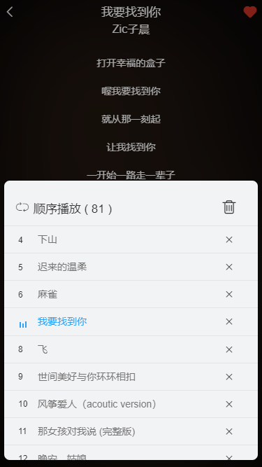
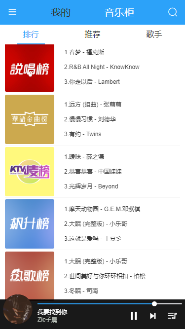
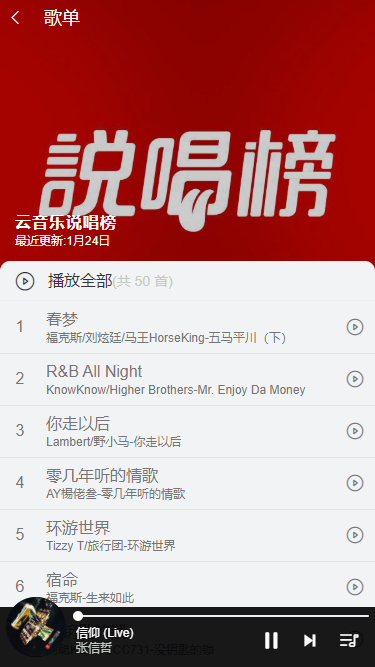
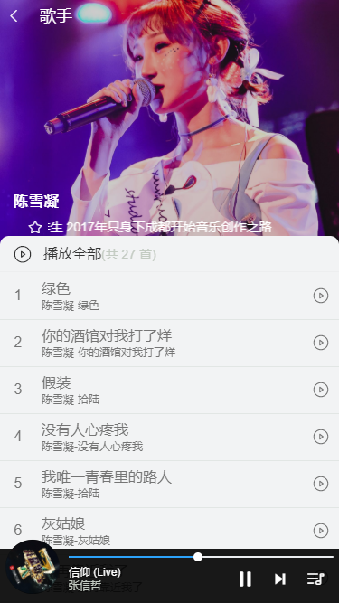
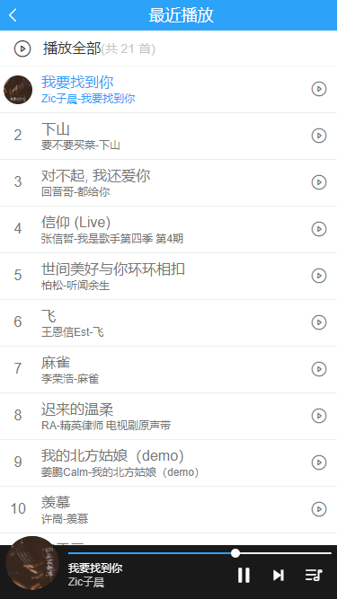

# 喵酷音乐

​     基于 `vue  ` 、 `vuex  ` 、`vue-router`  、 `axios`  、 `better-scroll` 、 `scss`  、`ES6` 、 `Vant`组件库 、 `vue-touch` 等开发一款移动端音乐`WebApp ` ， UI 界面参考了`ios`版的酷狗音乐、网易云音乐、flex布局

### 	实现功能 : 播放器内核、推荐页面、热榜页面、歌手页面、歌单详情、歌手详情、排行榜详情、搜索页面、播放列表、等等功能

### 	播放器

实现功能：顺序播放、单曲循环、随机播放、收藏等。

播放、暂停使用 HTML5 的 audio 实现。

数据、播放状态、播放历史、歌曲等方面使用了 `vuex` 来进行管理。

图标使用 `iconfont` 阿里巴巴图标库，中间的唱片旋转动画使用了 `animation` 实现。

歌词部分获取到网易的歌词数据，然后使用 第三方库 [`lyric-parser`](https://github.com/ustbhuangyi/lyric-parser) 进行处理。实现显示歌词、拖动进度条歌词同步滚动、歌词跟随歌曲进度高亮。

通过 `localstorage` 存储喜欢歌曲、播放历史数据。

​	  项目演示地址: [喵酷音乐](http://47.106.200.189/#/music-ark/recommend) 、当然你也可扫码访问:

​												


## 大致预览

### 播放器、播放列表

  


### 推荐、排行、歌手

  

### 歌单详情 、歌手详情

   


### 搜索页面

 

### 我的、我喜欢、最近播放

  


### 技术栈

#### 	前端

+ `vuex` `Vue` 集中状态管理 、在多个组件共享某些状态时方便管理
+ `vue-router` : 为单页面应用提供路由系统 
+ `better-scroll` : 解决了移动端各种滚动场景需求、使移动端滑动体验更加流畅
+ `ES6` : 使用 模块化 、解构赋值 、Promise 、Class 方法 ，加速开发
+ `Vant` 组件库 : 使用第三方 组件库 搭建页面应用 
+ `vue-touch` :  歌曲切换 、  切换路由 、提高用户体验效果
+ `vue-lazyload` : 实现图片懒加载，优化页面加载速度
+ `Scss` : `css `预编译处理器，简化了`css`的编写

#### 	后端

+ `NeteaseCloudMusicApi` : 网易云音乐 `NodeJS` 版  API , 提供音乐数据
+ `axios` : 用来请求后端API数据


### 其他工具

+ `iconfont` : 阿里巴巴矢量图标库 , 使用字体图标


## Project setup

```
npm install
```

### Compiles and hot-reloads for development
```
npm run serve
```

### Compiles and minifies for production
```
npm run build
```

### Lints and fixes files
```
npm run lint
```

### Customize configuration
See [Configuration Reference](https://cli.vuejs.org/config/).
